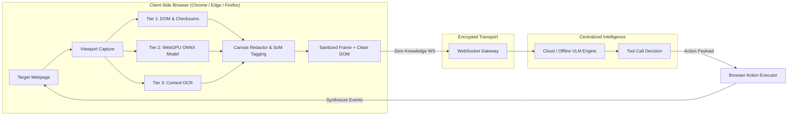

# Click — Privacy-Preserving Browser Vision Agent

[](https://sih.gov.in/)
[](https://developer.chrome.com/docs/extensions/mv3/intro/)
[](https://www.w3.org/TR/webgpu/)
[](https://fastapi.tiangolo.com/)
[](LICENSE)

> **Click** is a next-generation, client-side privacy-preserving vision agent for web browsers. It runs local computer vision and machine learning models directly inside the browser (via **WebGPU** and **ONNX Runtime Web**) to dynamically sanitize sensitive personal data (passwords, banking details, KYC IDs, and facial biometrics) **before** transmitting anonymized screen context to a central Vision-Language Model (VLM) for autonomous task automation.

---

## 💡 The Core Problem & Click's Solution

### The Challenge (SIH Problem Statement SIH26171)
Traditional browser automation agents stream raw video or high-resolution screenshots to central cloud VLMs. This practice introduces severe privacy hazards—inadvertently exposing plaintext passwords, OTPs, Aadhaar/PAN cards, credit cards, bank accounts, and biometric facial data to remote servers.

### The Click Solution
Click pioneers a **Zero-Knowledge Client-Server Architecture**:
1. **Client-Side Sanitization**: Runs a 3-tier local privacy shield in the browser to scrub PII and blur faces *before* any network request leaves the device.
2. **Visual Grounding**: Labels actionable UI elements using **Set-of-Marks (SoM)** (`p-XX` markers) so the remote VLM accurately grounds interactions without needing unredacted visuals.
3. **Closed-Loop Execution**: A central VLM interprets the sanitized context and returns structured tool actions (`click`, `type`, `scroll`, `hover`, `navigate`, etc.) which the browser executes and physically verifies.



---

## ✨ Key Features

- **🛡️ 3-Tier Client-Side Privacy Shield**:
  - **Tier 1 (DOM & Mathematical Checksums)**: Algorithmic validation using the **Verhoeff algorithm** (12-digit Aadhaar UIDAI) and **Luhn algorithm** (Credit/Debit cards), paired with contextual regex for PAN, Passports, Driving Licenses, Voter IDs, UPI VPAs, DOBs, and tokens. Includes Indian surname lexicons and kinship anchors (`S/O`, `D/O`).
  - **Tier 2 (On-Device Vision via WebGPU/WASM)**: Executes the `Ultra-Light-Fast-Generic-Face-Detector` (~1MB ONNX model) inside an isolated offscreen document using **ONNX Runtime Web** with discrete/integrated GPU priority.
  - **Tier 3 (Context-Gated OCR & StackBlur)**: Dynamically invokes Tesseract.js on text-sparse pages or scanned document images. Blurs detected faces via `StackBlur` and applies character-level masks to text PII.
- **🏷️ Set-of-Marks (SoM) Spatial Grounding**: Overlays interactive elements with numbered bounding tags (`p-01`, `p-02`), ensuring pixel-perfect clicks and eliminating hallucinated coordinates.
- **⚡ Hardware Acceleration**: Harnesses WebGPU for sub-35ms face detection inference and 2D canvas acceleration.
- **🔄 Physical Effect Contract**: Verifies real DOM mutations, focus changes, and navigation shifts after every action, escalating autonomously across selectors, labels, and coordinates if an element is stale.
- **📊 Real-Time Dual-View Inspector**: Extension Side Panel and floating HUD display side-by-side comparisons of the local raw view versus the server-sent sanitized frame with live latency telemetry.
- **🛒 Built-In SIH Benchmark Testbed**: Comes pre-packaged with realistic e-commerce checkout, net banking/KYC, and social profile verification scenarios.

---

## 📊 SIH26171 Evaluation Scorecard Alignment

| Evaluation Metric | Weight | Click Implementation |
| :--- | :---: | :--- |
| **Accuracy of Screen Visual Context** | **25%** | Set-of-Marks visual overlay + interactive DOM snapshot + multi-frame visual history window. |
| **Recall & Precision of PII Detection** | **20%** | Mathematical checksums (Verhoeff & Luhn) + 12 PII regex categories + surname lexicons ensure zero false negatives. |
| **Precision of Redaction** | **20%** | Sub-range character bounding rects (`Range.getClientRects()`) prevent over-redaction; localized StackBlur preserves UI layout. |
| **Client Resource Utilization** | **20%** | Ultra-lightweight ONNX model (~1MB), lazy OCR gating, WebGPU hardware acceleration, and process-isolated offscreen threads. |
| **End-to-End Latency** | **15%** | Sub-60ms DOM scans, WebGPU face inference under 35ms, lean WebSocket streaming payload. |

---

## 🛠️ Tool Calling & Autonomous Action Space

The reasoning engine interacts with web applications through an expressive, typed action contract:

| Tool | Parameters | Description |
| :--- | :--- | :--- |
| `click` | `selector`, `element` (`p-XX`), `coordinates` | Precision click on buttons, links, or custom canvas elements |
| `type` | `selector`, `text`, `clear_first`, `press_enter` | Types text into input fields (skips redacted fields) |
| `select_option` | `selector`, `value` | Native `<select>` dropdown option selection |
| `hover` | `selector`, `coordinates` | Mouse hover to reveal flyouts, menus, or tooltips |
| `drag` | `from_coordinates`, `to_coordinates` | Drag-and-drop on sliders, reordering lists, and canvas objects |
| `scroll` | `direction`, `amount`, `selector`, `coordinates` | Smooth window and inner-container scrolling |
| `navigate` | `url` | Direct URL navigation with load completion verification |
| `open_tab` / `switch_tab` | `url`, `tab_index` | Multi-tab tracking and navigation management |
| `press_key` | `key` | Dispatches keyboard events (`Enter`, `Escape`, `Tab`, etc.) |
| `ask_user` | `question`, `options` | Human-in-the-loop fallback for 2FA, OTPs, or CAPTCHA resolution |
| `finish_task` | `status`, `summary`, `data` | Ends the goal with structured verification evidence |

---

## 🚀 Setup & Launch Guide

### Prerequisites
- **Python 3.10+** (with pip added to PATH)
- **Node.js 18+** (with npm added to PATH)
- **Google Chrome** (v113+ recommended for WebGPU) or **Microsoft Edge**

---

### Step 1: Automated First-Time Setup
Double-click `start.bat` (or run it from terminal):
```bash
start.bat
```
> [!NOTE]
> On the first run, `start.bat` automatically installs all Python dependencies (`requirements.txt`) and Node.js dependencies (`electron`), creating a completely ready-to-run environment without manual setup.

---

### Step 2: Load the Browser Extension (One-Time Setup)
1. Open Google Chrome (or Microsoft Edge) and go to:
   ```text
   chrome://extensions
   ```
2. In the top-right corner, turn **ON** the **Developer mode** toggle.
3. Click the **Load unpacked** button that appears in the top-left toolbar.
4. Browse and select the **`browser-extension`** folder inside this project directory.
5. 📌 **Crucial Step — Pin the Extension**:
   - Click the puzzle piece icon (**Extensions** 🧩) in the top-right toolbar of Chrome.
   - Click the **Pin** (📌) icon next to **Click** so the icon remains permanently visible in your browser bar.

---

### 🎮 How to Run & Use Click (Two Ways)

Once installed, you can use Click through two flexible workflows:

#### 🌟 Way 1: Run via Desktop App (`start.bat`)
- Double-click `start.bat`.
- Automatically initializes the local Python reasoning backend and launches the standalone **Click Desktop Assistant**.
- Monitor tasks, view live telemetry, configure model keys, and manage automation goals from a sleek desktop window.

#### 🌐 Way 2: Run via Chrome Extension UI (In-Browser Side Panel)
- Ensure the backend is active (started via `start.bat`).
- While browsing any website, click the pinned **Click** icon (🖱️) in your Chrome toolbar.
- The interactive **Side Panel** immediately opens next to your webpage.
- Type any automation goal (or pick from the pre-packaged demo scenarios) and watch Click sanitize sensitive data on-device before executing tasks step-by-step!

---

## 📁 Repository Architecture

```
Click/
├── SYSTEM_ARCHITECTURE.md         # Detailed architectural specification (SIH26171)
├── start.bat                      # One-click launcher (installs dependencies, launches backend & desktop app)
├── start.sh                       # Linux / macOS launcher script
├── start_browser_agent.bat        # Lightweight browser-only backend launcher
├── browser-extension/             # Chrome/Edge Manifest V3 Client Extension
│   ├── manifest.json              # Extension permissions & entry points
│   ├── background.js              # Service Worker (WebSocket, tab capture & pipeline)
│   ├── content/
│   │   ├── pii_rules.js           # Verhoeff/Luhn checksums & KYC regex rules
│   │   ├── privacy_shield.js      # DOM semantic scanner & interactive tree builder
│   │   ├── action_executor.js     # Browser tool dispatcher (click, type, drag, scroll)
│   │   └── visual_overlay.js      # In-tab live status HUD & ripple animations
│   ├── offscreen/
│   │   ├── ml_engine.js           # WebGPU/WASM ONNX face detector & Tesseract OCR
│   │   └── offscreen.html         # Sandboxed background processing environment
│   ├── libs/                      # Bundled ONNX Runtime Web & WASM binaries
│   ├── models/                    # Slim-320 ONNX face detection model
│   └── sidepanel/                 # Extension side panel dashboard & dual-view inspector
├── backend/                       # Centralized Reasoning Server
│   ├── server.py                  # FastAPI WebSocket server & session router
│   ├── browser_vision_agent.py    # VLM prompt planner & multi-modal reasoning engine
│   ├── keys_manager.py            # Dynamic secure key rotation & settings management
│   ├── settings.json              # Model and agent runtime configuration
│   ├── requirements.txt           # Python dependencies (fastapi, uvicorn, requests)
│   └── static/demo/               # SIH Interactive Benchmark Suite
│       ├── checkout.html          # E-commerce checkout scenario (cards, CVV, address)
│       ├── banking.html           # NetBanking & KYC scenario (Aadhaar, PAN, passwords)
│       ├── social.html            # Social profile scenario (faces, avatars, emails)
│       └── privacy_test.html      # Comprehensive PII verification testbed
└── electron/                      # Optional desktop floating pill assistant & viewer
```

---

## 🔒 Security & Privacy Guarantees

1. **Zero Raw Frame Ingestion**: The server never receives raw, unredacted canvas screenshots or plaintext password strings.
2. **Deterministic Checksum Filtering**: Zero false positive redaction on 12-digit numbers using Verhoeff arithmetic checks.
3. **Local Offscreen Isolation**: Machine learning models run inside an unprivileged Chrome offscreen document, preventing script injection or cross-tab contamination.
4. **Human-in-the-Loop Safeguards**: The agent strictly refuses to bypass 2FA, OTPs, or financial payment authorization without explicit user delegation via `ask_user`.

---

## 📜 License

This project is licensed under the **MIT License** — see the [LICENSE](LICENSE) file for details. Built for the **Smart India Hackathon (Problem Statement SIH26171)**.
