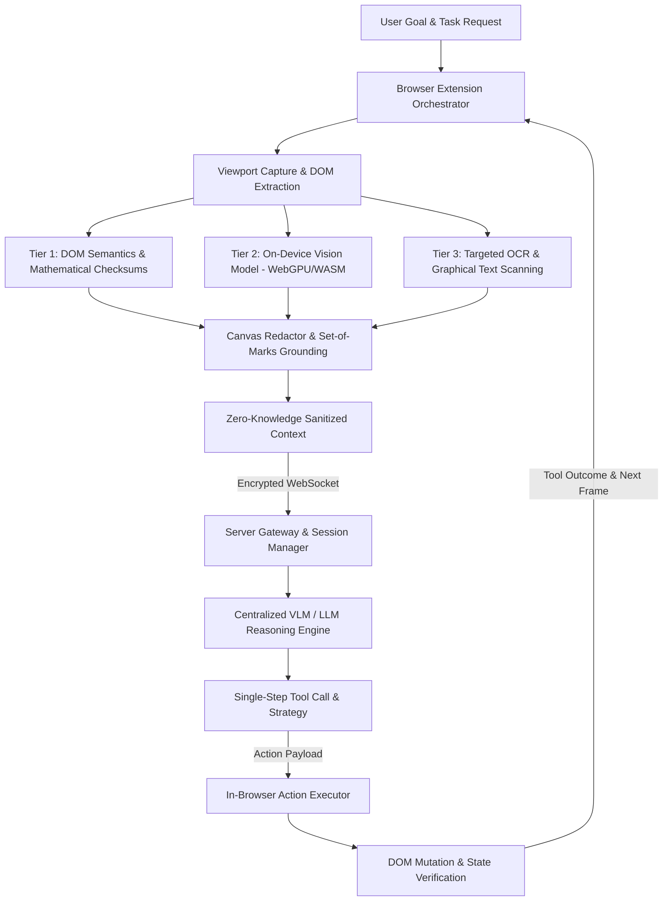
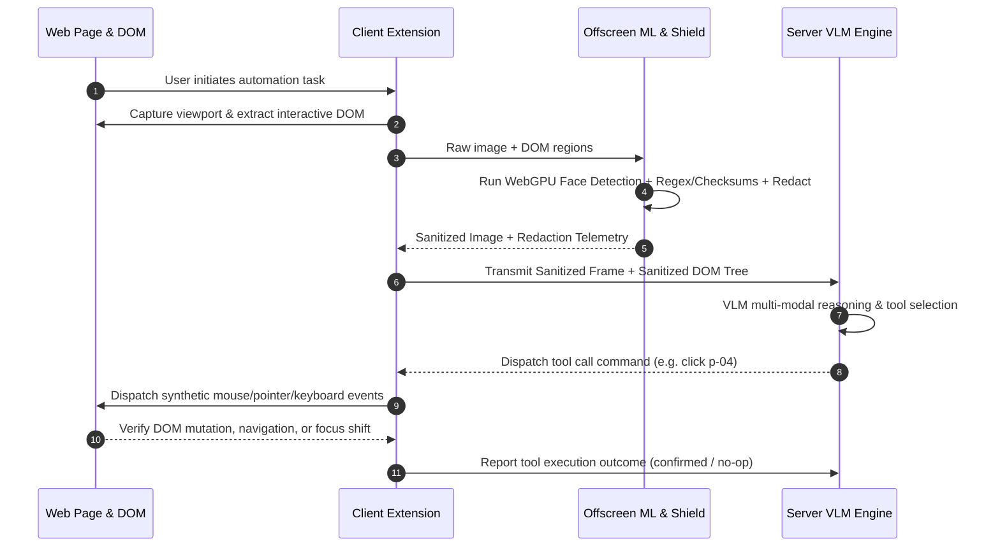

# Click — System Architecture: Privacy-Preserving Browser Vision Agent

**Click** is a high-performance, privacy-first agentic browser automation system adhering to Problem Statement SIH26171. The architecture splits responsibilities between a client-side on-device sanitization engine and a centralized Vision-Language Model (VLM) reasoning backend. Sensitive Personally Identifiable Information (PII) and biometric data are dynamically detected and redacted locally inside the browser before any network transmission occurs.

---

## 1. Client-Side Architecture (Browser Runtime)

The client runs inside modern web browsers (Chrome/Firefox) leveraging Manifest V3 with process separation:

- **Background Service Worker**: Event-driven controller managing tab lifecycles, viewport screen captures, offscreen lifecycle, and resilient WebSocket communication with the server.
- **Content Script Execution Engine**: Injected directly into the target web page. Extracts interactive accessibility trees, computes device-pixel-ratio (DPR) scaled element coordinates, and applies real-time DOM mutation monitoring.
- **Offscreen Processing Sandbox**: Dedicated `crossOriginIsolated` execution context hosting hardware-accelerated machine learning libraries and Web Workers without contending with the web page's primary UI thread.
- **Interactive UI Panel**: Extension Side Panel and live HUD providing continuous telemetry, privacy audit previews (sanitized vs. original), task status, and human-in-the-loop interfaces.

---

## 2. Three-Tier Client Privacy Sanitization Pipeline

Screen context is scrubbed of all confidential entities locally before any outbound request is constructed.

### Tier 1: DOM Semantic Analysis & Algorithmic Validators
- **Deterministic Checksum Validation**:
  - *Aadhaar (National ID)*: Verhoeff algorithm verifies genuine 12-digit identity formats, eliminating numeric false positives.
  - *Credit/Debit Cards*: Luhn algorithm evaluates candidate card patterns across Visa, MasterCard, Amex, and Discover formats.
- **Structured KYC & PII Pattern Engine**: Scans text nodes for PAN cards, Driving Licenses, Passports, Voter IDs, UPI VPAs, phone numbers, email addresses, and secret API tokens.
- **Contextual Heuristics & Lexicon Matching**: Identifies unlabeled person names through Indian surname lexicons, kinship indicators (`S/O`, `D/O`), honorific anchors (`Mr.`, `Dr.`), and tabular KYC column definitions.
- **Form & Input Masking**: Intercepts password fields, CVVs, credit card inputs, and session credentials directly via DOM input attributes.

### Tier 2: On-Device Vision Processing (WebGPU / WASM SIMD)
- **Local Vision Transformer / CNN**: Executes an ultra-lightweight generic face detector model (~1MB footprint) via ONNX Runtime Web.
- **Hardware Acceleration**: Automatically detects discrete GPUs (e.g., NVIDIA) or integrated GPUs (Intel/AMD) using WebGPU with `high-performance` power preference, falling back gracefully to multi-threaded WebAssembly with SIMD.
- **Biometric Detection**: Generates sub-millisecond bounding boxes for human faces, user avatars, and ID photographs embedded within page media.

### Tier 3: Selective In-Browser OCR & Redaction Compositor
- **Context-Gated OCR**: Dynamically triggers optical character recognition worker only on text-sparse pages, rendered canvases, or scanned document images to maintain low latency.
- **Pixel-Precise Canvas Redaction**:
  - *Faces*: Obfuscated using the StackBlur algorithm to preserve natural visual balance without exposing identifiable biometrics.
  - *Sensitive Text*: Overlaid with solid color masks and clear semantic labels (e.g., `[REDACTED: AADHAAR]`, `[REDACTED: CARD]`).
  - *Sub-Range Precision*: Calculates exact character-level text ranges to avoid over-redacting adjacent non-sensitive content.
- **Set-of-Marks (SoM) Grounding**: Overlays numbered bounding tags (`p-XX`) on actionable elements to enable deterministic spatial targeting for the remote reasoning model.

---

## 3. Client-to-Server Zero-Knowledge Data Contract

Data transmitted over the network is strictly anonymized, ensuring the server never ingests private user information:

| Data Channel | Transmitted to Server | Retained Strictly on Client |
| :--- | :--- | :--- |
| **Visual Stream** | Redacted screenshot with blurred faces & PII badges | Raw screenshot, visible face biometrics |
| **Interactive DOM** | Sanitized element tree (`[REDACTED: SENSITIVE]`) | User passwords, plain-text credentials, raw KYC data |
| **State Metadata** | Page title, sanitized URL, viewport dimensions | Unsanitized form cache, local cookie data |
| **Telemetry** | Processing latency, redaction counts, GPU backend | User identity records, private browsing history |

---

## 4. Server-Side Reasoning & VLM Decision Engine

The server operates statelessly with pluggable support for offline-deployable open-weight models or cloud-hosted endpoints:

- **WebSocket Gateway**: Asynchronous connection manager handling continuous duplex communication, heartbeat monitoring, and session isolation.
- **Multi-Frame Visual Session Memory**: Tracks task progression across consecutive turns, retaining historical sanitized frames to evaluate dynamic interface changes.
- **Visual Grounding & Reasoning Engine**:
  - Consumes the redacted screenshot alongside the Set-of-Marks tag mapping.
  - Decomposes the user's objective into verified subtasks before taking action.
  - Matches requested actions to explicit element IDs, eliminating coordinate hallucination.
- **Unified Tool Calling Interface**:
  - *Browser Interaction*: `click`, `type`, `select_option`, `scroll`, `hover`, `drag`, `press_key`.
  - *Navigation & Tabs*: `navigate`, `go_back`, `open_tab`, `close_tab`, `switch_tab`, `refresh`.
  - *Information Retrieval*: `extract_content`, `read_page`.
  - *Human-in-the-Loop*: `ask_user` (for multi-factor authentication, CAPTCHA, or ambiguous options).
  - *Task Completion*: `finish_task` with verification status (`success`, `partial`, `failure`).

---

## 5. Client-Side Execution & Verification Loop

Closed-loop feedback mechanism ensuring robust handling of dynamic web applications:

- **Physical Effect Contract**: Actions are verified by observing URL shifts, DOM tree mutations, and focus updates, categorizing results into `confirmed`, `suspected_noop`, or `unverifiable`.
- **Escalation Ladder**: Automatically switches grounding methods (selector $\rightarrow$ label $\rightarrow$ coordinates) and prevents cyclic scrolling loops if page response stalls.

---

## 6. SIH26171 Evaluation Criteria Alignment

| Evaluation Metric | Architectural Implementation |
| :--- | :--- |
| **1. Screen Context Accuracy (25%)** | Set-of-Marks visual tagging combined with structured DOM accessibility tree and multi-turn visual history window. |
| **2. PII Detection Recall & Precision (20%)** | Hybrid 3-tier pipeline combining Verhoeff/Luhn checksums, comprehensive Indian/global PII regex, surname lexicons, and ONNX models. |
| **3. Precision of Redaction (20%)** | Character-precise text bounding ranges prevent over-redaction; localized StackBlur preserves image layouts without data leakage. |
| **4. Client Resource Utilization (20%)** | Lightweight ONNX model (~1MB), selective OCR gating, WebGPU hardware acceleration, and process-isolated offscreen threads. |
| **5. End-to-End Latency (15%)** | Sub-60ms DOM scans, WebGPU face inference under 35ms, lean payload sizes, and asynchronous WebSocket pipelining. |
